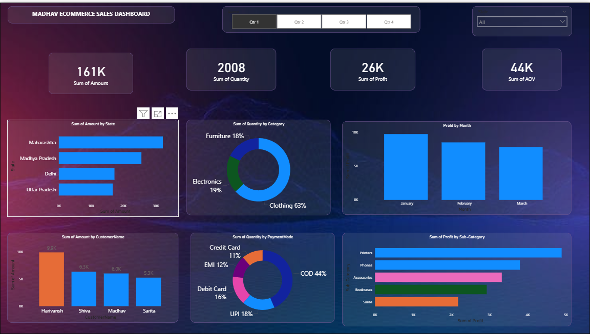

# Madhav E-Commerce Sales Dashboard

## Dashboard Preview

## Overview
Interactive Power BI dashboard analyzing e-commerce sales
data across Indian states, product categories and payment modes.

## Key Metrics
| Metric | Value |
|--------|-------|
| Total Revenue | ₹3,789 |
| Total Quantity Sold | 87 |
| Total Profit | ₹536 |

## Features
- Quarter-wise filtering (Q1 to Q4)
- State-wise sales breakdown
- Category and sub-category profit analysis
- Payment mode distribution (COD, UPI, Debit, Credit)
- Customer-level sales insights

## Tools Used
- Power BI Desktop
- DAX (Data Analysis Expressions)
- Data Modeling

## How to View
1. Download the `.pbix` file from this repo
2. Open with Power BI Desktop (free download)
3. Explore the interactive dashboard freely
